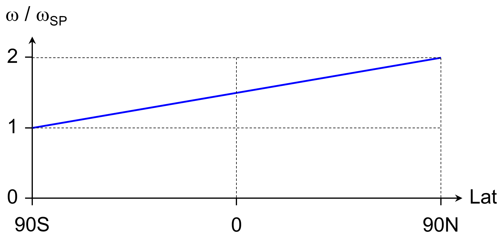
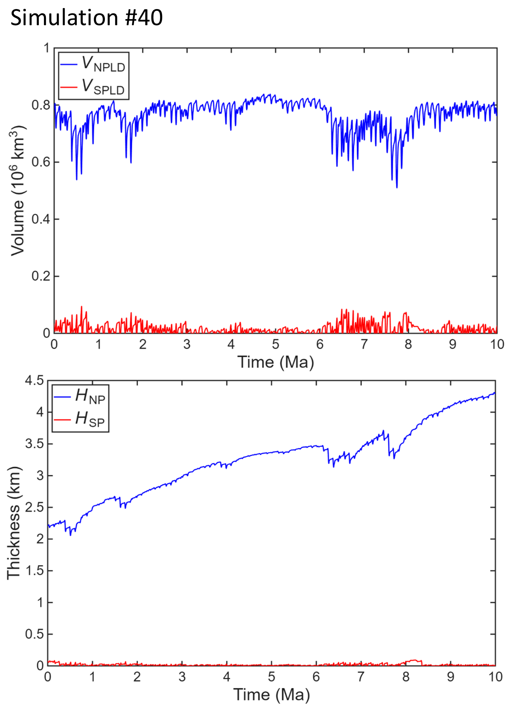

# Summary

The Mars Atmosphere-Ice Coupler `MAIC-2` is a computationally efficient, zonally-averaged model designed to simulate Martian surface temperature, atmospheric water transport and surface glaciation over timescales of $10^5$ to $10^7$ years. While sophisticated General Circulation Models (GCMs) provide high-resolution simulations of the Martian atmosphere, their high computational cost makes them largely unsuitable for studies covering millions of years of orbital evolution. `MAIC-2` addresses this gap by utilizing physically-based, zonally-averaged parameterizations, including a Local Insolation Temperature (LIT) scheme and a mass balance engine driven by free-convection and instantaneous mixing physics. Version 2.3 introduces a fully modularized Fortran architecture that improves maintainability and ensures that the software remains entirely self-contained, requiring no external numerical libraries or specialized data formats for execution. Demonstrated through a 20-million-year transient simulation, the model successfully reproduces the primary characteristics of the Martian polar layered deposits. MAIC-2 provides the planetary science community with a versatile, open-source tool for investigating the long-term climatic impacts of orbital variations on the Martian surface.

# Statement of need

Understanding the history of the Martian climate and surface glaciation requires simulating processes over paleoclimatological timescales ($10^5$ to $10^7$ years). While sophisticated General Circulation Models (GCMs) – such as the Mars Planetary Climate Model (PCM) [@forget_etal_1999; @forget_etal_2022; @millour_etal_2024] and the NASA Ames MGCM [@haberle_etal_2003; @kahre_etal_2023; @kahre_etal_2024] – provide high-resolution simulations of the Martian atmosphere for the present, other time-slices or short periods of time, they are computationally intensive because they solve the full equations of fluid dynamics and thermodynamics. This high computational cost makes them largely unsuitable for studies covering millions of years of orbital evolution.

`MAIC-2` (Mars Atmosphere-Ice Coupler Version 2) addresses this need by providing a computationally efficient model specifically designed for long-term paleoclimate studies. It simplifies the complex descriptions of the Martian climate found in GCMs by utilizing a set of physically-based, zonally-averaged parameterizations. This approach allows the model to bridge the gap between high-fidelity atmospheric simulations and the multi-million-year timescales required to investigate the evolution of surface ice and polar layered deposits. 

The physics of the model is explained in the study by @greve_etal_2010 and shall not be repeated here in detail. Key features and needs fulfilled by `MAIC-2` include:

* **Computational efficiency:** `MAIC-2` allows for transient simulations over 10 million years or more, which is currently unfeasible for standard GCMs.

* **Orbital forcing integration:** The model is driven directly by essential orbital parameters – obliquity, eccentricity, and solar longitude of perihelion – allowing researchers to study how shifts in Mars' orbit drive "ice ages" and the formation of polar layered deposits (PLDs).

* **Coupled surface-atmosphere processes:** It integrates a Local Insolation Temperature (LIT) scheme with parameterizations for atmospheric water transport (via instantaneous mixing) and surface mass balance.

* **Predictive accuracy for glaciation:** Despite its simplicity, the model produces a remarkably good agreement with observed present-day polar ice volumes and thicknesses, making it a useful ("All models are wrong, but some are ..."; George Box) tool for reconstructing past glacial distributions.

* **Versatility in application:** `MAIC-2` can simulate both "academic" scenarios with constant orbital parameters and realistic transient histories, providing insights into the hemispheric asymmetry of ice distribution and the mobility of mid-latitude glaciers.

By providing an open-source, efficient alternative for simulating the Martian water cycle and surface ice evolution, `MAIC-2` enables the planetary science community to explore the long-term climatic impacts of orbital variations that shaped the Martian surface. Due to its simplicity, the model is also suitable for educational use.

# Software design

The `MAIC-2` (Mars Atmosphere-Ice Coupler Version 2) software is implemented in Fortran and has recently undergone a major architectural refactoring to transition from a collection of independent subroutines to a fully modularized design. This modernization, finalized in version 2.3 [@maic2_git_v2p3_2026], encapsulates the physical parameterizations of the model within discrete Fortran modules, which improves code maintainability and ensures robust interface checking during compilation. By grouping related physical processes – such as the Local Insolation Temperature (LIT) scheme, atmospheric mixing, and surface mass balance – the structure of the program now more clearly reflects the coupled nature of the Martian climate system it simulates.

A primary design goal for `MAIC-2` is extreme ease of use and portability across different computing environments. The software is entirely self-contained and does not require any external tools, numerical libraries, or specialized data formats such as NetCDF or Make. By relying solely on standard Fortran features, the program eliminates the complex dependency chains often associated with climate models, making it exceptionally simple to install and execute on any system with a standard Fortran compiler. This lightweight approach ensures that researchers can quickly deploy the model without the overhead of managing external software environments.

The computational core of the program is built around a finite-difference/finite-volume discretization of the governing equations. The model operates on a one-dimensional latitudinal grid, typically using a $1^\circ$ spacing to balance spatial resolution with the high computational efficiency required for long-term paleoclimate studies. The simulation is driven by an orbital driver that numerically integrates the relationship between solar longitude ($L_\mathrm{s}$) and time to account for the significant eccentricity of the Martian orbit. This ensures that the seasonal forcing – including the variations in daily mean insolation and the timing of the CO$_2$ frost cycle – is physically accurate over timescales spanning millions of years.

The modular design specifically separates the calculation of surface temperatures from the mass balance engine. The LIT module determines temperatures by solving a radiation balance that accounts for the minimum threshold of CO$_2$ condensation ($148.7\;\mathrm{K}$ for a surface pressure of $700\;\mathrm{Pa}$) and the energy required for seasonal frost sublimation. Simultaneously, the mass balance engine calculates evaporation through free-convection physics and condensation via an instantaneous mixing approximation of atmospheric water vapor. These results are coupled to a static ice tracker that evolves the local ice thickness based on the net balance of these processes. To support the scientific community, the `MAIC-2` package now includes a user manual in Markdown format, providing guidance on compilation and the configuration of physical constants such as the evaporation factor and the regolith-insulation coefficient.

As an aside, the LIT module of `MAIC-2` is also integrated in the 3D ice-sheet model `SICOPOLIS` [SImulation COde for POLythermal Ice Sheets, @sico_git_v26_2026]. This allows to carry out more refined simulations of the Martian PLDs that include englacial dynamics and thermodynamics.

# Example: Paleoclimatic and future-climate simulation over 20 million years

## Orbital parameters

Using a numerical model of the solar system, @laskar_etal_2004 computed the evolution of the orbital parameters (obliquity, eccentricity, solar longitude of perihelion) of Mars. On time scales of 100 million years ($100\;\mathrm{Ma}$) and more, the solution is chaotic and therefore not predictable; however, a robust solution could be provided for the period from $20\;\mathrm{Ma}$ ago until $10\;\mathrm{Ma}$ into the future. The obliquity is shown in \autoref{fig_obliquity}. It features a main cycle with a period of $125\;\mathrm{ka}$, a modulation with a period of $1.3\;\mathrm{Ma}$, and a secular shift from ${\sim}35^\circ$ to ${\sim}25^\circ$ average obliquity at ${\sim}4\;\mathrm{Ma}$ ago, marked in the figure by "Stage&nbsp;1" and "Stage&nbsp;2", respectively.

![Obliquity from $20\;\mathrm{Ma}$ ago until $10\;\mathrm{Ma}$ into the future [@laskar_etal_2004]. \label{fig_obliquity}](Figure_Obliquity.png){ width=95% }

## Set-up

We illustrate the use of `MAIC-2` with the example of a transient simulation from $10\;\mathrm{Ma}$ ago until $10\;\mathrm{Ma}$ into the future, forced by the orbital parameters by @laskar_etal_2004 as described above. A similar simulation from $10\;\mathrm{Ma}$ ago until today was already discussed by @greve_etal_2010 (their simulation #6, `run_t06` in the `MAIC-2` GitHub repository). It provided a good agreement between simulated and observed present-day volumes of the north-polar and south-polar layered deposits (NPLD, SPLD) and ice thicknesses at the respective poles. However, a weakness was that the simulation predicted that the present-day PLDs both formed during the last $10\;\mathrm{Ma}$. This contradicts datings based on crater statistics which indicate that the basal unit of the NPLD and almost the entire SPLD are much older than a few millions of years [e.g., @herkenhoff_plaut_2000].

Therefore, we employ a modified set-up. For the instantaneous mixing of atmospheric water vapour, we introduce a prescribed north-south gradient such that $\omega_\mathrm{NP}/\omega_\mathrm{SP}=2$ (where $\omega_\mathrm{NP}$ and $\omega_\mathrm{SP}$ denote the depth-integrated water content $\omega$ [mass per area] at the north and south pole, respectively). This choice is motivated by the topographically-forced asymmetry in the Martian circulation [@richardson_wilson_2002], and the resulting distribution of the water content is shown in \autoref{fig_water_content}.

{ width=70% }

Further changes of the set-up are as follows:

* Initial ice layer of $5.25\;\mathrm{m}$ thickness on the entire surface [simulation #6: $19\;\mathrm{m}$].

* Exponent of the latitude-dependent parameterization for the daily cycle of the surface temperature: $n=4$ [simulation #6: $n=3$; cf.&nbsp;@greve_etal_2010 [Eq.&nbsp;16]].

* Dust insulation factor $E_0=0.05$ [simulation #6: $E_0=0.1$].

* Numerical time-step $\Delta{}t=8\;\mathrm{sols}$ [simulation #6: $\Delta{}t=0.02\;\mathrm{a}$ ($\approx{}7\;\mathrm{sols}$)].

The simulation as specified above is referred to as simulation #39 (from $10\;\mathrm{Ma}$ ago until today) and simulation #40 (continuation until $10\;\mathrm{Ma}$ into the future). In the `MAIC-2` GitHub repository, the respective designations are `run_t39` and `run_t40`.

## Results

\autoref{fig_vol_thk_paleo} depicts the volume of the PLDs (defined as the ice volume for latitudes ${\geq}75^\circ$N and ${\geq}75^\circ$S, respectively) and ice thickness at the poles for our new simulation #39 compared to simulation #6 by @greve_etal_2010. In both cases, we see a very mobile glaciation in stage&nbsp;1 (the period of high average obliquity prior to $4\;\mathrm{Ma}$ ago), during which the ice is redistributed constantly between the high, mid and low latitudes, and ice thicknesses at any position on the planet never exceed some $100\;\mathrm{m}$. During stage&nbsp;2 (low average obliquity since $4\;\mathrm{Ma}$ ago), massive PLDs form. As already mentioned above (subsection "Set-up"), the results of simulation #6 contradict the greater age of the basal unit of the NPLD and almost the entire SPLD. By contrast, simulation #39 produces only a massive glaciation in the north, while the southern glaciation remains very much limited. 

Significantly, simulation #39 predicts three large-scale erosional events at ${\sim}3.2$, 1.9 and $0.7\;\mathrm{Ma}$ ago that interrupt relatively continuous growth of the NPLD in the past $4\;\mathrm{Ma}$. This is, to first order, consistent with the finding of three periods of massive ablation within the internal stratigraphy of the NPLD [@holt_etal_2012; @steel_holt_2012; @smith_etal_2026].

{ width=99% }

Snapshots of the Martian glaciation during stage&nbsp;1 ($7.5\;\mathrm{Ma}$ ago, obliquity $36.4^\circ$) and stage&nbsp;2 (today, obliquity $25.2^\circ$) for simulation #39 are shown in \autoref{fig_thk_paleo_snap}. The state at $7.5\;\mathrm{Ma}$ ago is characterized by thin NPLD (thickness at the north pole ${\sim}60\;\mathrm{m}$), almost no ice at the south pole, yet extensive ice cover in the mid and low latitudes. By contrast, the situation for today shows no ice outside the polar regions, NPLD with a volume of $7.9\times{}10^5\;\mathrm{km}^3$ and a thickness at the pole of $2.2\;\mathrm{km}$, and much smaller SPLD with a volume of $2.3\times{}10^4\;\mathrm{km}^3$ and a thickness at the pole of merely $77\;\mathrm{m}$.

To interpret these results, it must be noted that the basal unit of the NPLD and the bulk volume of the SPLD, which most likely predate the period of time considered here substantially (see above, subsection "Set-up"), are not part of the simulation. Considering this, the agreement between the simulated and observed present-day conditions is good. The present-day NPLD excluding the basal unit has an estimated volume of $8.2\times{}10^5\;\mathrm{km}^3$ [@putzig_etal_2009], which matches our simulated figure very well. As for the SPLD, @smith_etal_2016 report a volume of $7\times{}10^3\;\mathrm{km}^3$ for its discontinuous, recent deposits. While this volume is a factor 3 smaller than our simulated counterpart, both numbers are small: the model successfully reproduces the fact that recent SPLD accumulation constitutes only a small part (of the order of 1%) of the bulk volume of the SPLD.

{ width=75% }

The results of simulation #40, the continuation of simulation #39 for $10\;\mathrm{Ma}$ into the future, are shown in \autoref{fig_vol_thk_future}. Since this period is part of stage&nbsp;2 (low average obliquity), no major regime shift is predicted. The volume of the NPLD remains large, with a generally increasing concentration of the ice close to the pole, towards a thickness of ${>}4\;\mathrm{km}$. By contrast, the volume of the SPLD remains small, with an ice thickness at the pole never exceeding $100\;\mathrm{m}$, and episodically a complete loss of the ice.

{ width=50% }

# AI usage disclosure

No generative AI tools were used in the development of this software. The manuscript is also human-written; however, we used Google Gemini for suggestions to improve the writing.

# Acknowledgements

We thank Isaac B. Smith (York University, Toronto, Ontario, Canada; Planetary Science Institute, Lakewood, Colorado, USA) for his interest in the model results, which encouraged us to resume development of `MAIC-2` after a long hiatus.

We acknowledge financial support from the German Research Foundation (Deutsche Forschungsgemeinschaft, DFG) via the Priority Programme "Mars and the Terrestrial Planets", and from the Institute of Low Temperature Science, Hokkaido University, via a Leadership Research Grant.

# References
